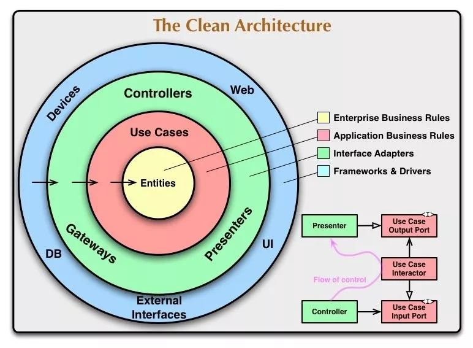
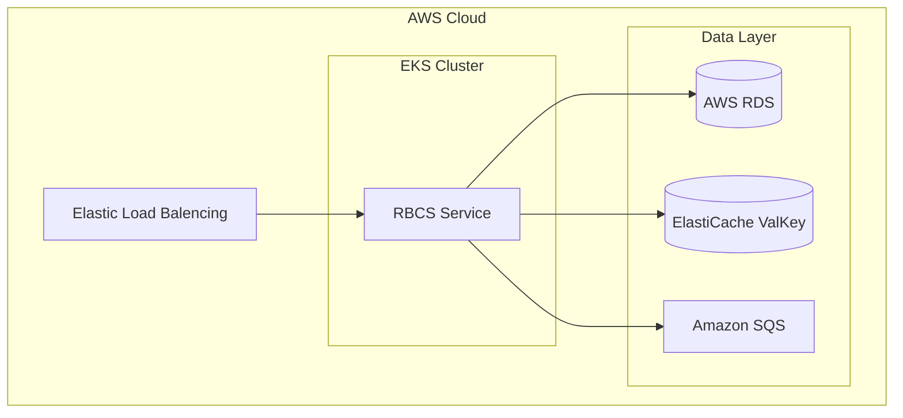

# 实时余额计算系统（RBCS）

## 项目框架

选择DDD的简洁架构（clean architecture），基于springboot进行实现

其程序框架如下： 


基本的约束是内层禁止依赖外层，必须依赖的场景，通过依赖导致来实现。可参考instructure中的sqs实现

## 目录结构

```
RBCS
├── application - 应用层，负责对外部接口提供抽象，组合调度
├── domain - 领域层，基于Account和Transaction两个领域的原子能力实现
├── instrastruture - 基础设施层，负责和外部组件交互的实现、适配。domain和application只能依赖接
```

## 优点
可扩展性、可测试性和可读性取得一个比较好的平衡，domain因为和外部环境无关，因此可以更好的实现单元测试
domain和service的解耦也让实体内聚在自己的原子能力中，由service来负责组装调度。此时service更像是一个编排的职责，那么测试重点也就聚焦控制流的测试

## 缺点
对性能有一定的取舍，因为无法针对数据库、缓存等场景进行特别的操作


## 本地开发

本地开发需要依赖MySQL和Redis，可在application.yml中修改相关配置

## aws部署

提供了构建部署脚本

```sh
sh build-image.sh && sh deploy.sh

```

### aws演示环境
访问地址为：[http://k8s-default-rbcs-02495c7571-041c1e0a2184a86f.elb.ap-northeast-1.amazonaws.com](http://k8s-default-rbcs-02495c7571-041c1e0a2184a86f.elb.ap-northeast-1.amazonaws.com)

本服务只提供接口访问，接口调用视频见[接口使用示例](./doc/video/接口使用示例.mov)

## 关键技术

### hibernate L2 cache
本项目使用hibernate L2 cache + redission实现数据的缓存，以减少同一账户高并发场景下的IO操作。  
但这个方案也存在不足，目前无法解决缓存穿透问题，且当前项目未实现缓存预热。  
实现缓存预热比较简单，启动的时候基于热数据做一次查询即可。  
针对缓存穿透的场景可能需要考虑在service层做特殊处理，但这样就破坏了目前的开发范式，对开发人员有比较高的要求，即懂如何处理缓存，还要了解业务以及系统的实现，此方案的可维护性不佳。  

### aws sqs
本项目使用sqs实现削峰填谷，sqs特有的消息质量保障能力也保证了交易事务的高可靠性。同时采用了scheduler（见RBCSApplicationServiceImpl）来进行兜底保障，确保交易的执行。

**注意**：sqs只是一个消息队列，没有topic的能力，因此本地和远端如果复用一个sqs服务时，要注意使用两个队列，避免消息消费不到

### 分布式锁
本项目使用redission实现分布式锁，主要用在交易场景（见TransactionServiceImpl）和账户状态更新（见AccountServiceImpl）
但目前在项目中的使用，有破坏范式的嫌疑（依赖了redission库的interface），最好的实践是单独定义一个lock interface（或服用Java的lock定义），在infrastructure中使用redission实现该接口，因为时间的关系这部分改造没有执行

### spring event事件驱动
为了保证各领域的逻辑内聚，通过spring event在单一系统内以事件驱动的方式解耦。同时spring event集成了事务相关的逻辑处理，我们可以更好的实现在事务完成后发送消息。见Defer的使用

## 质量保障

质量是一个较大的话题，本项目从性能测试、单元测试、集成测试、并发测试、可用性测试五个维度来保证。其中单元测试、并发测试和部分集成测试通过Junit来实现，更便捷的实现CI。但此模式可能有一些和外部组件交互的场景没有办法验证到，故单独引入了apifox（类似postman）的工具，以接口自动化的方式来实现集成测试，因为大部分边界已经在Junit中覆盖了，因此这个接口自动化的测试主要是验证部署在真实环境的服务功能完整性。

相关报告见[reports](./reports)

P.S. 可用性测试目前进行得比较简单，只是kill pod观察程序的反应，相关视频见[故障测试.mov](./doc/video/故障测试.mov)

## 安全

本项目在设计之初是以该服务作为金融微服务中的一个子域，只负责交易计算，不直接对外部用户，因此没有特别实现登录、OAuth等机制，一开始是想通过spring security + jwt来实现简单的接口鉴权，因为时间缘故没有完成。

另外数据库的id目前简单使用了自增id，但这样会存在安全风险，理想的情况下是引入雪花算法生成全局唯一id，这部分目前也未引入。

## 部署架构

最新的部署架构如下：


和最初的设计有一定的差异，原因在于：
1. 对AWS的操作不熟，监控相关的配置没有来得及加上
2. Account和Transaction如果分开部署，则会引入分布式事务，带来额外的复杂度，单独分离的好处相比于复杂度来说性价比不高，故最终选择把Account当成是一个支撑域，和Transaction合并在一个界限上下文中
3. 原计划通过API Gateway来实现安全校验（即API Gateway这个pod负责对外的流量，Account和Transaction网络隔离，只能透过API Gateway访问），但引入Gateway还需要引入服务发现，复杂度上升，没有来得及实现

## License

本项目所依赖的开源组件，均为Apache License 2.0，无法务风险。本项目也准从 Apache License 2.0开源协议