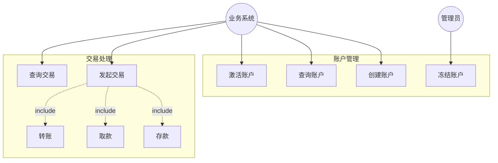
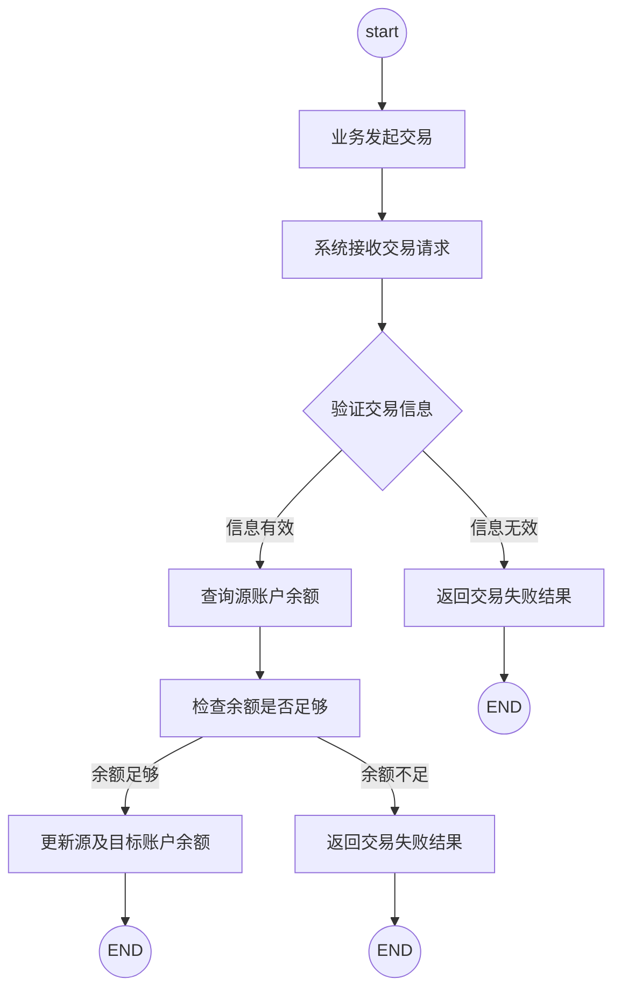
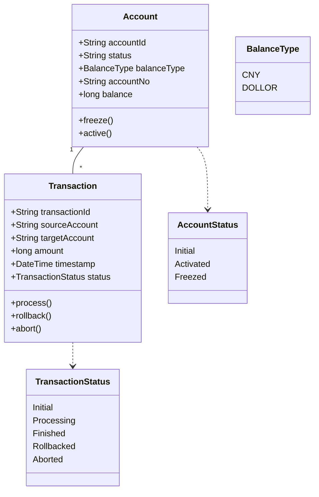
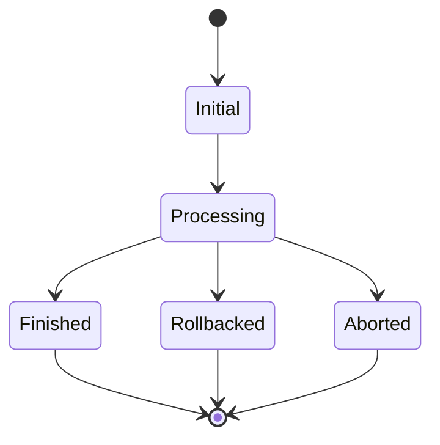
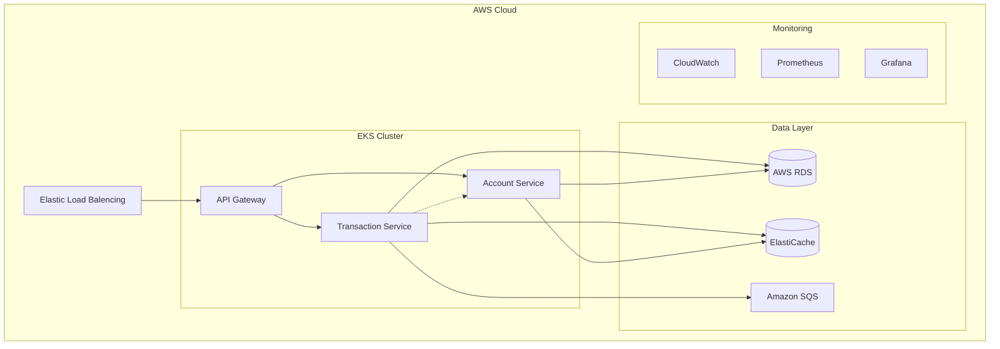
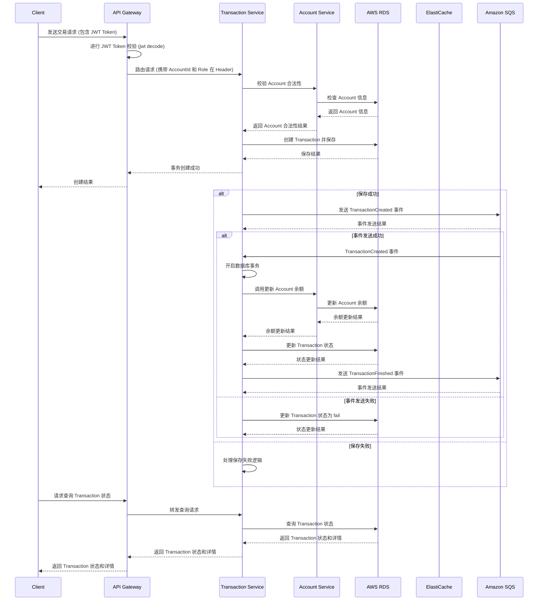
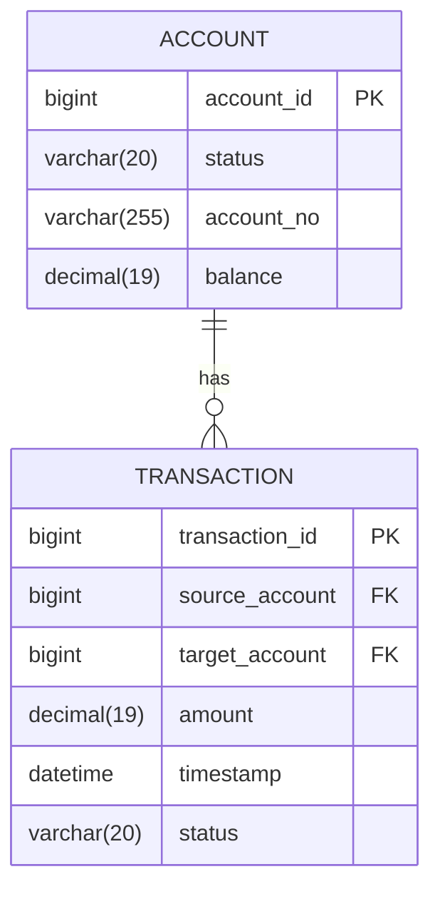

# Real-time Balance Calculation System Design

# 1. 需求分析

这个系统我们定义为金融领域内的关键系统，不直接对外承接业务，而是聚焦在账户交易上。其原因是作为金融领域一个非常核心的业务场景，能够正确、高效的响应交易是核心，而围绕在这之上的诸如用户账号、理财、开卡办卡、信用卡等业务场景，其逻辑会很复杂，全部耦合在一块，会让该系统复杂度上升，进而影响稳定性。因此我们在领域模型上，把账户交易归属在一个界限上下文中，只负责解决账户交易这一底层的逻辑场景。

经过如此的限定，我们可以不用考虑用户、管理员之类的角色，把这部分放到其他域中来实现，进而可以弱化权限的限定（诸如管理员才能冻结账户这类限制），只聚焦在账号交易场景的约束上。

P.S. 交易范围局限在单一币种，多币种间的转账由其他业务系统统一完成汇率转换后再进行

## 1.1 用例设计

## 1.2 业务流程图

## 1.3 非功能性需求分析

> 首先这是一个典型的金融领域的系统，至少需要保证:
- 实时性：交易处理要快速响应
- 一致性：账户余额必须准确,不能出错
- 高可用：系统要能承受高并发且不能中断
- 可扩展：要支持业务增长
基于CAP理论，想要同时保障实时性、一致性、可用性是不可能的，必须有所取舍。在金融领域，一致性是不能丢弃的，而可用性会影响银行业务的口碑，因此只能在实时性上有所取舍。

在实时性的取舍上，基于业务场景，我们可以做出如下取舍：
1、在写入（存钱、转账）场景，使用异步事务的方案来提高系统吞吐量，在交互上进行两阶段提示（commit、processing）来让用户有系统已经在快速处理的错觉（类似现在转账后出现倒计时）
2、在读（查询余额）的场景，可以通过UI界面提示可能会有2小时的延迟以降低用户预期

系统要支持高频交易，保障强一致性会导致其瓶颈在数据库上，性能提升的代价较高，我们可以采用最终一致性的方案，在提高吞吐量的同时确保交易最终是准确的，故而我们可以引入高速缓存。但在写场景下，如果要允许短期不一致，会额外引入过多的复杂度，结合在实时性上的取舍，我们可以利用缓存优化读场景下的性能，减轻数据库的压力（毕竟金融场景读一定是写的数倍）

扩展来看，一个具备可扩展性、可用性的系统，至少要具备可观测性，这是能够认为评价系统效用的一个关键。因此系统需要支持系统级的监控、业务关键指标的监控（包括存钱、取钱、转账的频次）

因为定义为内部系统，保障安全基线即可，通过RBAC实现有限的访问控制，原则上，该服务对内开放，对外部网络隔离
> 
1. 性能需求
    - 系统响应延迟<500ms
    - 交易事务完成时长 < 2h
    - 系统支持 1000 TPS
2. 可用性需求
    - 系统可用性99.99%
    - 支持故障自动恢复
    - 支持异地多活部署（二期实现）
3. 扩展性需求
    - 支持动态扩缩容
    - 支持新业务快速接入
4. 安全性
    - 支持基于RBAC的访问控制，角色的设定交由上层应用来决定
5. 可观测性
    - metrics（系统级包括CPU、内存、网络带宽；业务级包括：事务的创建和状态更新）
    - logging（支持基于事务进行全链路日志观测）
    - tracing（支持服务间的调用和耗时统计）

# 2. 领域模型

交易状态图

# 3. 架构设计

综合项目时间，第一个版本我们基于cloud-native的方案，尽可能采用现有的方案完成业务需求。

我们基于AWS构建我们的服务，因此在方案选型上，围绕AWS所提供的组件来完成业务目标，降低集成难度，达到快速上线的目标。

## 高可用设计

两个服务均采用无状态设计，通过消息队列（SQS）来完成交易过程的流转。因此Account和Transaction可以实现动态扩缩容，基于AWS的HPA实现。

### 关于服务发现

本期版本，考虑交付时间和需求优先级，我们优先采用K8S内置的CoreDNS结合Ingress来实现服务发现和负载均衡，降低部署的复杂度和运维难度。毕竟当前阶段只需要考虑Account和Transaction的扩缩容，因此用内置的方案是足够的，我们可以基于Restful的接口规范，通过资源与pod一一匹配的模式来实现路由规则

## 可观测性设计

非核心需求，解决有无问题为主，用最小的成本来实现，即采用AWS能提供的全托管方案，包括EKS内置的CloudWatch（系统监控），Promethus（业务监控）和Granfana（展示）

## 安全性设计

基于JWT实现访问鉴权。JWT的好处是无需额外的服务交互，基于CPU运算，并且自带关键业务属性，在保证安全的前提下可以实现快速便捷的调试。该系统属于IO密集型应用，CPU理论上相对于IO来说有富裕，因此使用JWT能更好的利用闲置资源。

通过payload里不同的role来区分角色，jwt token的下发，由上层的业务系统来决定。

## 数据库设计

### Account表

| 字段名 | 数据类型 | 说明 | 外键关联 |
| --- | --- | --- | --- |
| account_id | BIGINT | 账户ID，主键 | - |
| status | int(4) | 账户状态，取值为Initial(0)、Activated(1)、Freezed(2) | - |
| account_no | VARCHAR(255) | 账号 | - |
| balance | DECIMAL(19, 4) | 账户余额（单位厘，RMB） | - |
| balance_type | int(16) | RMB(0)，DOLLOR(1) |  |

### Transaction表

| 字段名 | 数据类型 | 说明 | 外键关联 |
| --- | --- | --- | --- |
| transaction_id | BIGINT | 交易ID，主键 | - |
| source_account | BIGINT | 源账户ID，外键关联account表的account_id | REFERENCES account(account_id) |
| target_account | BIGINT | 目标账户ID，外键关联account表的account_id | REFERENCES account(account_id) |
| amount | BIGINT | 交易金额（单位厘，RMB） | - |
| timestamp | DATETIME | 交易时间戳 | - |
| status | VARCHAR(20) | 交易状态，取值为Initial、Processing、Finished、Rollbacked、Aborted | - |

## 写操作的原子性约束

针对Transaction的写操作，使用事务保证原子性，包括校验账户信息（账户状态、余额）、更新余额、更新Transaction状态

## 缓存设计

### 账户表

| 字段 | 说明 | 示例 |
| --- | --- | --- |
| Key | 缓存的键，使用账户 ID | `1234567890` |
| Value | 存储账户信息的哈希映射，包含账户状态、余额和余额类型 | `{ "status": "Activated", "balance": 1000, "balanceType": "CNY" }` |
| TTL | 缓存的生存时间，为 600 秒加上 60 秒的随机数。这样做的目的是避免大量缓存同时失效导致的雪崩效应。具体TTL的数值和业务场景相关，这里随便拍了10分钟，可配置 | `3600 + rand(0, 600)` |

### 缓存穿透问题设计

- 预热阶段以及账户数据插入阶段，使用bloomfilter进行缓存预热；
- 进一步的，空值使用空值缓存；
- 未命中缓存时，需要加上互斥锁，再进行数据库读操作

### 缓存更新约束（保证读的最终一致性，保证写的强一致性）

- 针对余额的写请求，当且仅当写入数据库成功后更新缓存
- 缓存更新失败时删除缓存
- 写操作采用读写锁（提高读的效率，保证写的强一致性）

## 锁约束

锁均采用分布式锁，以便应对扩缩容；

复用同一个缓存组件降低运维成本；

优先使用读写锁（交易相关），特殊情况下考虑互斥锁（缓存穿透）

# 4. 质量保障

1. 单元测试
    - 测试覆盖率要求>80%，交易核心域覆盖率100%
    - 特别考虑并发场景
2. 功能测试
    - 使用APIFOX进行API测试以及场景模拟测试
    - 用例设计：
    [RBCS-用例设计](./usecase-design.md)
    
3. 性能测试
    [RBCS性能测试方案](./performan-test-design.md)
    
4. 故障测试
    - 随机关掉某个container，观察功能测试结果是否正常
    - pod restart，观察功能测试结果是否正常

# 5. 未来扩展点

1. 性能优化
    - 引入CQRS模式分离读写
    - 使用分库分表应对数据增长
    - 引入余额pool的概念，预分配余额来提高针对单一账号的并发能力
2. 容灾方案
    - 实现跨区域多活
    - 完善监控告警体系
3. 安全
    - k8s的网络安全配置
4. 健壮性
    - 混沌工程